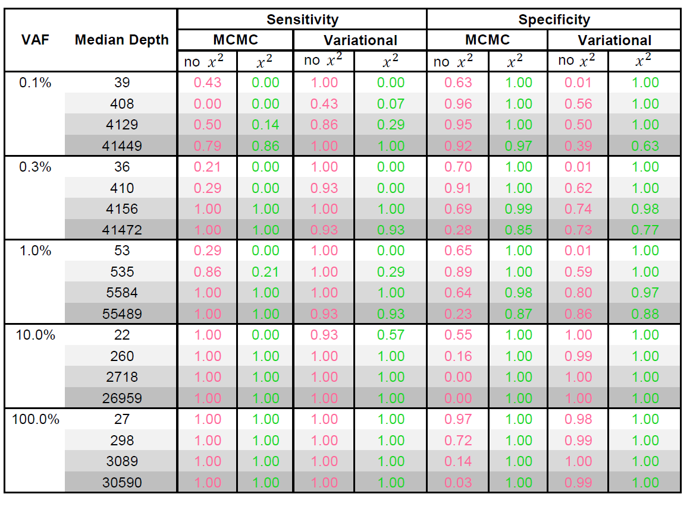
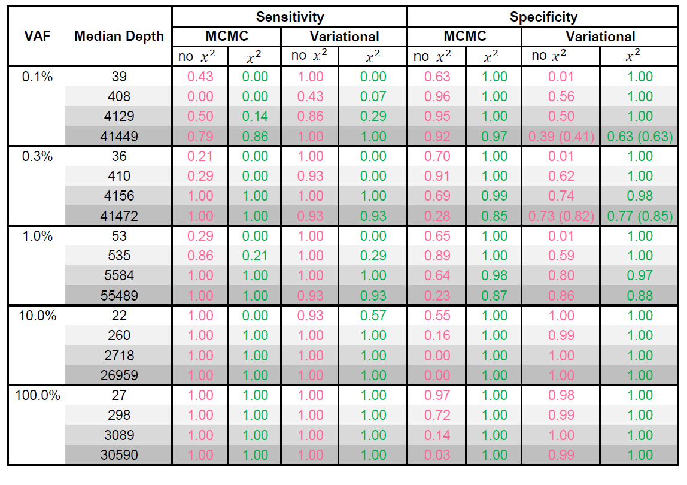
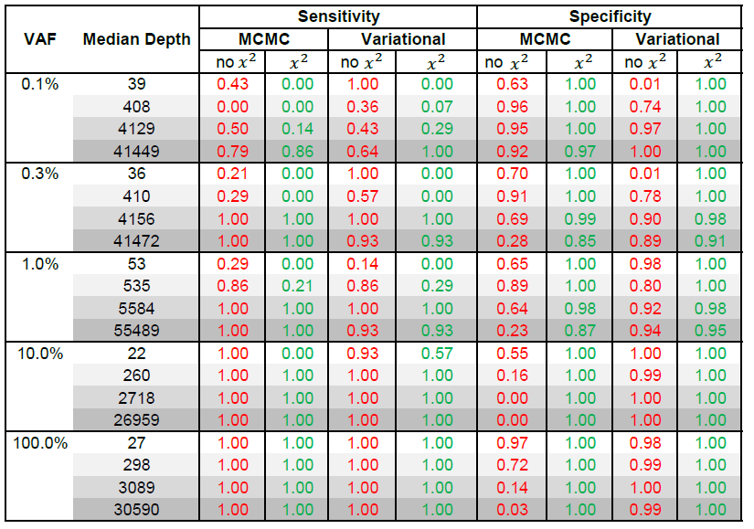

2015-09-28 Set threshold delta gamma ELBO update
==============================

Purpose
------------
Improve the specificity by   
- setting threshold for delta update and gamma update,   
- adjust bounds for M, delta, gamma when optimizing them,   
- and test different initial values to get rid of local optimal.   

Conclusions
-----------------
Sensitivity and specificity is getting much better when I set threshold for ELBO increase and update for delta and gamma. It is better than MCMC method.
   
Background
-----------------
Beta distribution is the proposal variational distribution for both Muj and \theta.  
Variant positions = [84,104,124,144,164,184,204,224,244,264,284,304,324,344] 

Materials and Equipment
------------------------------
1. Set threshold for delta and gamma in rvd2\_var.py
2. Do both with Chi2 and without Chi2.
3. Define optimization stopping criterion  

	    MAXITER = 50  
	    ELBOTOLPCT = 0.01 *100  
	    MAXVARITER = 50       
	    NORMTOL = 0.1

Experimental Protocol
---------------------------
1.  `python rvd3.py`
2.  `python runall.py`
3.  `python test_all.py`
4.  `python character.py`

###Issues when running the program:  
#####- Limit delta and gamma to [0.0001, 10000], so that np.log(gam) is [-10, 10]. 
#####- Most of time, ELBO converges in 50 iterations. In some event, it takes more than 50 iterations to run variational E-step to 100.0*(var\_elbo[-1] - var\_elbo[-2])/abs(var\_elbo[-2]) < 1. We let it stop with the stop critiron of 50 iterations at most.

#####- We let it stop when the ELBO update is small enough even though the gamma and delta is still updating. Does it make sense? 
Because there are three conditions in the variational stop critiron. It will run when:   
variter < MAXVARITER and delta\_varelbo_pct > ELBOTOLPCT and (norm\_delta\_delta > NORMTOL or norm\_delta\_gam > NORMTOL)
 

Results
----------- 
####- ELBO and timing for each iteration of EM variational algorithm.

####For VAF=100%

1. 40000X median read depth:

		M-iteration	E-iteration	ELBO	Increase Percentage	delta-deltaprev	gam-gamprev	t-gam	t-delta	t-mu0	t-M0	t-M
		0	0	-97929774.40	0.000%							
		0	1	-33063403.22	66.238%	854388.90	277249.86	110.52	0.79			
		0	2	-16856374.73	49.018%	220483.39	287734.94	97.68	0.76			
		0	3	-9742286.40	42.204%	102161.14	208609.65	105.85	0.70			
		0	4	-6060430.63	37.793%	55141.49	171197.79	103.79	0.71			
		0	5	-3979345.45	34.339%	33497.80	143827.10	97.23	0.63			
		0	6	-2720418.88	31.637%	22025.36	124668.54	96.55	0.67			
		0	7	-1928542.15	29.109%	21935.12	108625.80	103.33	0.62			
		0	8	-1406909.37	27.048%	10897.59	88754.74	88.41	0.63			
		0	9	-1055992.82	24.942%	31270.35	69595.87	82.84	0.59			
		0	10	-810542.68	23.244%	6103.57	63312.78	78.92	0.53			
		0	11	-636078.11	21.524%	4709.54	54050.46	62.89	0.59			
		0	12	-509465.89	19.905%	3711.97	50078.71	66.02	0.54			
		0	13	-415566.31	18.431%	2988.09	37650.64	58.23	0.51			
		0	14	-344948.53	16.993%	2437.50	24503.11	51.58	0.50			
		0	15	-291320.54	15.547%	2016.66	22523.08	46.86	0.58			
		0	16	-249734.67	14.275%	1677.16	11395.03	60.86	0.48			
		0	17	-217645.64	12.849%	1420.07	13451.45	50.40	0.48			
		0	18	-192318.58	11.637%	1200.95	7251.39	46.95	0.51			
		0	19	-171920.38	10.606%	1064.08	13100.81	39.77	0.51			
		0	20	-155258.63	9.692%	925.94	17047.82	40.34	0.48			
		0	21	-142025.72	8.523%	827.04	7809.54	39.00	0.50			
		0	22	-130846.71	7.871%	748.39	10359.91	40.72	0.43			
		0	23	-121697.21	6.993%	630.17	15995.09	42.04	0.52			
		0	24	-114517.17	5.900%	540.52	6461.06	43.76	0.53			
		0	25	-108501.66	5.253%	494.62	10276.04	40.49	0.48			
		0	26	-103115.70	4.964%	516.72	7783.20	39.35	0.50			
		0	27	-98887.21	4.101%	420.33	1598.56	39.54	0.53			
		0	28	-95579.58	3.345%	360.64	3767.48	38.58	0.49			
		0	29	-92693.16	3.020%	337.63	7696.31	37.20	0.52			
		0	30	-90111.11	2.786%	326.36	6057.18	36.97	0.47			
		0	31	-87860.80	2.497%	291.30	3741.28	31.72	0.48			
		0	32	-85959.04	2.165%	266.83	6151.50	36.79	0.54			
		0	33	-84298.89	1.931%	250.20	6004.31	39.49	0.46			
		0	34	-82900.08	1.659%	223.92	91.01	30.18	0.53			
		0	35	-81573.88	1.600%	221.68	477.33	33.77	0.46			
		0	36	-80365.36	1.481%	205.10	923.43	36.67	0.47			
		0	37	-79243.93	1.395%	190.05	826.63	33.07	0.51			
		0	38	-78232.12	1.277%	177.18	76.97	38.49	0.44			
		0	39	-77309.18	1.180%	166.06	94.04	31.46	0.48			
		0	40	-76447.95	1.114%	156.16	255.20	32.48	0.47			
		0	41	-75654.22	1.038%	141.64	196.69	39.14	0.43			
		0	42	-74897.08	1.001%	138.07	210.25	31.79	0.44			
		0	43	-74278.73	0.826%	112.72	421.81	34.56	0.51			
		1	0	-54474.08	99.944%					1.29	0.62	46.37
		1	1	-17341.38	68.166%	115230.72	79676.26	58.05	0.72			
		1	2	-13684.39	21.088%	20259.85	23888.83	49.43	0.59			
		1	3	-10249.99	25.097%	6117.13	21833.61	36.52	0.58			
		1	4	-10160.08	0.877%	553.71	60.57	27.84	0.59			
		2	0	-7478.49	86.271%					0.82	0.73	36.63
		2	1	-4422.75	40.860%	69562.32	197163.83	52.02	0.71			
		2	2	-3649.79	17.477%	47998.20	57550.31	25.62	0.62			
		2	3	-3623.25	0.727%	565.58	10385.22	16.89	0.53			
		3	0	-3436.13	54.053%					1.06	0.68	21.13
		3	1	-3211.17	6.547%	12035.09	188698.56	48.18	0.67			
		3	2	-3164.93	1.440%	573.22	8954.64	19.90	0.51			
		3	3	-3155.79	0.289%	561.97	5065.58	16.78	0.53			
		4	0	-3138.76	8.654%					0.63	0.72	9.92
		4	1	-3118.27	0.653%	3687.73	45700.89	42.55	0.62			
		5	0	-3115.24	0.749%					0.56	0.70	8.42
		Total elapsed time is 6657.994 seconds.

2. 4000X median read depth

		M-iteration	E-iteration	ELBO	Increase Percentage	delta-deltaprev	gam-gamprev	t-gam	t-delta	t-mu0	t-M0	t-M
		0	0	-9464946.82	0.000%							
		0	1	-3116522.32	67.073%	290105.72	243558.13	99.18	0.81			
		0	2	-1598361.74	48.713%	64085.16	259587.10	91.76	0.70			
		0	3	-901082.19	43.625%	43213.95	194108.82	82.63	0.70			
		0	4	-536148.21	40.500%	37147.48	191218.25	80.70	0.67			
		0	5	-331309.37	38.206%	16848.20	129936.35	83.36	0.68			
		0	6	-210547.59	36.450%	22832.07	130456.85	80.86	0.67			
		0	7	-137233.47	34.821%	49000.08	110124.55	77.75	0.69			
		0	8	-91418.43	33.385%	68494.64	110303.10	89.02	0.70			
		0	9	-62269.46	31.885%	52788.85	97202.95	75.30	0.61			
		0	10	-43515.10	30.118%	38521.40	79236.09	72.62	0.71			
		0	11	-31128.01	28.466%	16901.12	68747.27	67.80	0.59			
		0	12	-23054.34	25.937%	33081.23	55165.40	62.59	0.60			
		0	13	-17721.53	23.132%	32565.03	43988.48	54.96	0.59			
		0	14	-14151.00	20.148%	1858.33	35301.73	56.80	0.54			
		0	15	-11764.68	16.863%	1496.83	28228.13	44.72	0.56			
		0	16	-10042.66	14.637%	1344.78	27504.60	47.46	0.52			
		0	17	-8762.12	12.751%	1103.42	18575.70	39.96	0.56			
		0	18	-7710.39	12.003%	1086.31	22744.60	38.06	0.46			
		0	19	-6949.57	9.867%	938.92	15648.54	35.63	0.53			
		0	20	-6425.62	7.539%	759.13	19164.24	35.34	0.49			
		0	21	-6015.45	6.383%	658.27	19279.64	36.16	0.47			
		0	22	-5659.65	5.915%	691.65	15994.90	32.98	0.53			
		0	23	-5406.61	4.471%	504.58	4619.97	32.54	0.53			
		0	24	-5202.70	3.772%	508.17	4777.17	33.21	0.46			
		0	25	-5042.09	3.087%	431.90	1275.18	35.66	0.45			
		0	26	-4914.49	2.531%	445.06	5027.60	35.00	0.47			
		0	27	-4815.37	2.017%	426.47	8094.46	28.19	0.51			
		0	28	-4738.52	1.596%	382.66	1443.56	29.63	0.45			
		0	29	-4674.88	1.343%	406.39	2128.55	28.82	0.50			
		0	30	-4625.10	1.065%	283.72	221.98	27.13	0.48			
		0	31	-4585.81	0.850%	244.06	866.21	31.15	0.48			
		1	0	-3610.86	99.962%					0.83	0.63	34.18
		1	1	-2204.72	38.942%	163833.33	148179.00	50.43	0.79			
		1	2	2802.52	227.115%	286756.14	10274.94	44.37	0.82			
		1	3	3292.79	17.494%	27545.38	10302.40	29.59	0.61			
		1	4	3436.87	4.376%	19260.10	324.99	23.24	0.57			
		1	5	3467.08	0.879%	15275.96	4270.67	23.10	0.56			
		2	0	4561.79	226.336%					0.94	0.71	26.28
		2	1	6310.28	38.329%	50204.58	199373.83	56.29	0.63			
		2	2	10730.92	70.055%	275193.41	4340.03	32.14	0.70			
		2	3	11032.77	2.813%	22831.31	12114.22	20.24	0.56			
		2	4	11115.46	0.750%	14831.03	10843.32	17.07	0.58			
		3	0	11638.24	155.124%					1.12	0.65	16.16
		3	1	12213.61	4.944%	19055.47	186677.66	45.91	0.54			
		3	2	12400.58	1.531%	44499.17	17438.29	28.89	0.55			
		3	3	12467.74	0.542%	27322.95	20838.69	19.29	0.48			
		4	0	12516.74	7.548%					0.74	0.64	15.75
		4	1	12576.72	0.479%	17588.83	53743.03	33.98	0.59			
		5	0	12585.69	0.551%					0.72	0.62	10.61
		Total elapsed time is 5030.027 seconds.

3. 400X median read depth
	
		M-iteration	E-iteration	ELBO	Increase Percentage	delta-deltaprev	gam-gamprev	t-gam	t-delta	t-mu0	t-M0	t-M
		0	0	-727163.18	0.000%							
		0	1	-100727.11	86.148%	399509.52	162340.13	65.83	0.96			
		0	2	-41758.95	58.542%	21457.52	131848.93	58.81	0.59			
		0	3	-9208.18	77.949%	5694.54	191676.78	47.66	0.59			
		0	4	2439.60	126.494%	1152.95	216838.87	30.29	0.52			
		0	5	8685.48	256.021%	680.73	22014.54	27.58	0.52			
		0	6	12244.16	40.973%	5633.09	12563.46	29.40	0.60			
		0	7	14555.26	18.875%	19209.80	29778.18	27.34	0.54			
		0	8	16212.89	11.389%	32213.51	56132.72	24.63	0.54			
		0	9	17139.25	5.714%	19347.85	52101.31	20.13	0.61			
		0	10	18023.04	5.157%	21475.32	35658.23	17.65	0.49			
		0	11	19371.19	7.480%	47110.68	72604.16	26.14	0.52			
		0	12	20573.82	6.208%	73030.42	91178.08	13.41	0.54			
		0	13	21089.66	2.507%	40319.67	46718.12	9.46	0.56			
		0	14	21413.05	1.533%	20589.53	34885.94	14.87	0.50			
		0	15	21546.77	0.624%	12089.47	32852.54	9.70	0.43			
		1	0	22512.92	103.096%					1.59	0.89	9.03
		1	1	23302.96	3.509%	8412.20	338315.29	58.13	0.57			
		1	2	23365.81	0.270%	12298.23	26842.93	26.60	0.49			
		2	0	23402.25	3.950%					0.50	0.82	18.38
		2	1	23474.33	0.308%	920.37	20701.27	41.25	0.45			
		3	0	23480.29	0.333%					0.56	0.88	10.05
		Total elapsed time is 1297.783 seconds.

4. 40X median read depth
	
		M-iteration	E-iteration	ELBO	Increase Percentage	delta-deltaprev	gam-gamprev	t-gam	t-delta	t-mu0	t-M0	t-M
		0	0	-71839.20	0.000%							
		0	1	-4547.36	93.670%	418835.94	173730.26	49.33	0.93			
		0	2	21742.67	578.138%	5055.64	133640.65	52.55	0.50			
		0	3	22943.62	5.523%	194.53	327359.63	21.48	0.52			
		0	4	23280.77	1.469%	535.47	19988.35	6.78	0.51			
		0	5	23417.76	0.588%	27.33	23404.33	6.32	0.50			
		1	0	23713.74	133.009%					0.90	0.74	11.61
		1	1	24452.48	3.115%	5906.42	333396.80	53.90	0.52			
		1	2	24909.37	1.868%	2768.34	50402.63	20.47	0.52			
		1	3	24998.27	0.357%	4.09	50010.36	14.67	0.46			
		2	0	25073.88	5.736%					0.61	0.82	20.16
		2	1	25178.76	0.418%	95.91	65847.35	38.75	0.51			
		3	0	25189.26	0.460%					0.51	0.82	13.36
		Total elapsed time is 817.192 seconds.

####- Sensitivity and Specificity: variational algorithm with Chi2 test works as well as MCMC in sensitivity and specificity. The specificity is getting a little worse when the median read depth increases from 4000X to 400000X when VAF=0.1%, 0.3%, and 1.0% events, which is also shown in the results by MCMC method.

Add results of mcmc without Chi2:

#### Rerun rvd3 with stop criterion of "ELBOTOLPCT = 0.1%" instead of 1% for the events with read depth is high at VAF=0.1%, 0.3%, and 1.0%. The Specificity is improved.

####Study the only one position that we missed in the event of VAF=1.0% when read depth is 55489. The initial value might be  far away from 1.0% and give a local optimum so that could be the reason failing to call the position.
Using synthetic\_toc\_p1_test  

- RVD3 failed to call position 345 when read depth is 55489 at VAF=1.0%.  
When seed = 19860522, Initial gam : [9859.8, 967.4], and Initial muj: 0.91.  

- I changed another seed (seed = 1986), Initial gam: [93.5, 6660.8], and Initial muj: 0.01. RVD3 called 345 successfully with another initial gam and muj.

The posterial distribution is plotted in folder \2015-10-14\_Plot\_mcmc\_mu\_vs\_variational\_mu.  
Hdf5 and vcf files are stored in \hdf5\_test\_345 and \vcf\_test\_345.

### Found a bug in the test function.
**In the test function, sigma should be the square root of variance, I forgot to take the square root of it!  z=(\mu\_1-\mu\_2)/sqrt(\sigma\_1^2 + \sigma\_2^2)
The sensitivity/specificity is much improved after I fixed this bug!!**  
Because \sigma\_1^2 + \sigma\_2^2 is smaller than 1, so the square root of it is bigger, then z is smaller, p-value is bigger. That means many false positive calls are gone and specificity is getting higher.

Archived Samples
-------------------------

Archived Computer Data
------------------------------

Prepared by: _______Fan Zhang_______     Date: ___________2015/10/24_________

Witnessed by: ________________________
