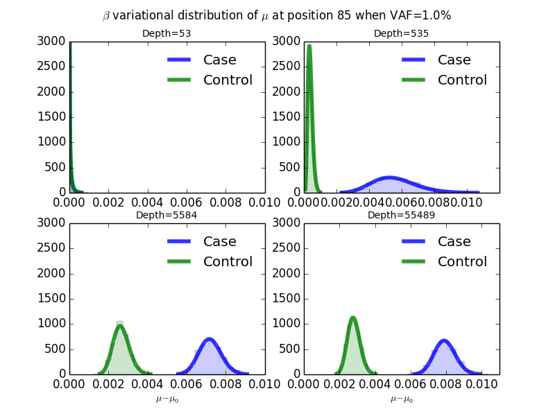
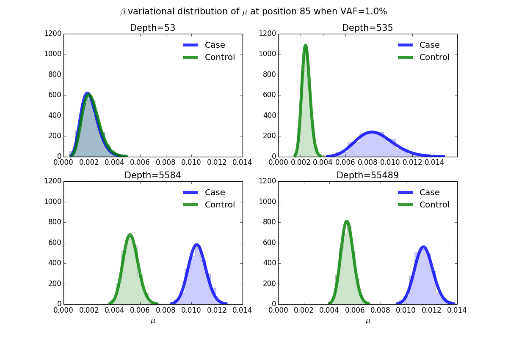
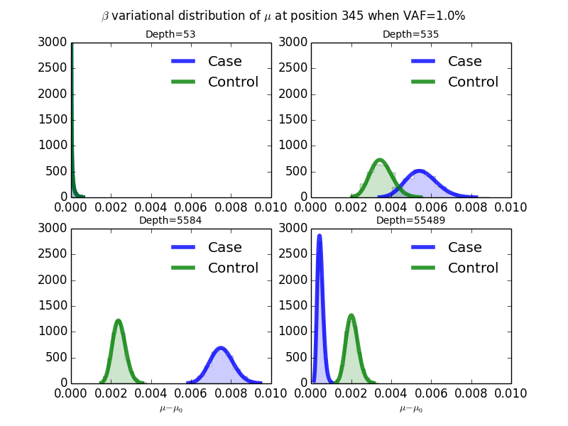
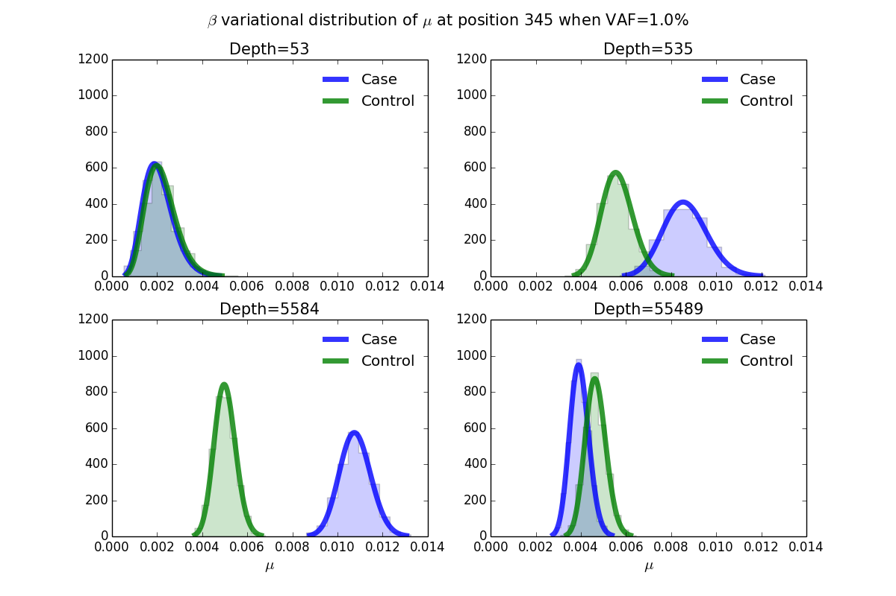
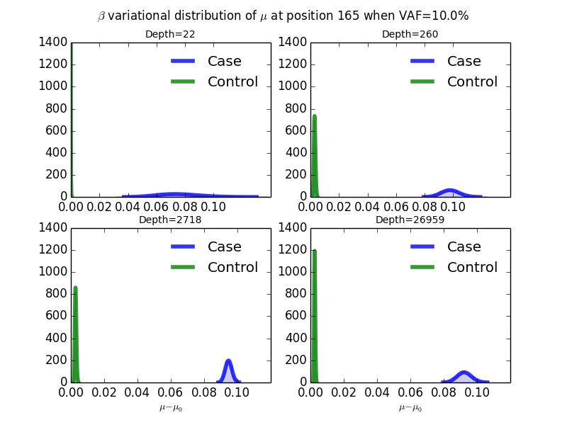
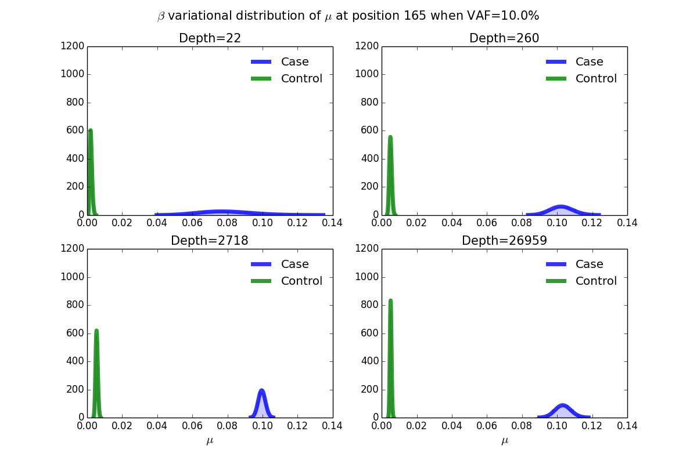

2015-10-05 Plot variational mu rvd3 synthetic data set
==============================

Purpose
------------
Plot the variational posterior distribution of mu^case and mu^control to see how the approximated Beta distribution looks like.

Conclusions
-----------------
Beta distribution gives good approximation of variational posterior distribution for \mu_j.
   
Background
-----------------

Materials and Equipment
------------------------------
The results files (HDF5 and VCF) are in folder "2015-09-28\_Run\_synthetic\_data\_set\_threshold\_delta\_gamma\_ELBO\_update".

Experimental Protocol
---------------------------
1. Plot approximated variational distribution of a position at XXX VAF and XXX read depth in single plot.
  `python plot_mu.py`
2. Plot approximated variational distribution of a position at XXX VAF with different read depths in subplots.
  `python subplot_mu.py`

Results
----------- 
Take three events for example (mu and mu-mu0 are both plotted to see how mu0 influences the actual mu of case and control):  

1.According to the VCF file of event of position 85 when VAF=1.0%:   
-RVD3 called position 85 as a variant when median read depth is 55489 and 5584.  
-RVD3 failed to call position 85 when median read depth is 535 and 53.  
-RVD2 has the same result at this event.

		Plot mu of position 85
		mu0^control: [ 0.00218019]
		mu0^case [ 0.00207443] 
		
		mu0^control: [ 0.00210808]
		mu0^case [ 0.0031198] 
		
		mu0^control: [ 0.00260857]
		mu0^case [ 0.00326153] 
		
		mu0^control: [ 0.00260339]
		mu0^case [ 0.00347374] 

2.According to the VCF file of event of position 345 when VAF=1.0%:  
-RVD3 called position 345 as a variant when median read depth is 5584.  
-RVD3 failed to call position 345 when median read depth is 55489, 535, and 53.  
-RVD2 called position 345 when median read depth is 55489 and 5548. 

		Plot mu of position 345
		mu0^control: [ 0.00218019]
		mu0^case [ 0.00207443] 
		
		mu0^control: [ 0.00210808]
		mu0^case [ 0.0031198] 
		
		mu0^control: [ 0.00260857]
		mu0^case [ 0.00326153] 
		
		mu0^control: [ 0.00260339]
		mu0^case [ 0.00347374]

####Test the hypothesis that he reason for poor sensitivity/specificity w/o Chi^2 is due to different mu0 for the case and control.  
####mu0 of control and muo of case are not very different. 

3.According to the VCF file of event of position 165 when VAF=10.0%:   
-RVD3 called position 165 as a variant when median read depth is 26959, 2718, and 260.  
-RVD3 failed to call position 165 when median read depth is 22.   
-RVD2 has the same result at this event.

		Plot mu of position 165
		mu0^control: [ 0.00218019]
		mu0^case [ 0.00357582] 
		
		mu0^control: [ 0.00210808]
		mu0^case [ 0.00444037] 
		
		mu0^control: [ 0.00260857]
		mu0^case [ 0.0048772] 
		
		mu0^control: [ 0.00260339]
		mu0^case [ 0.01096113] 

Archived Samples
-------------------------

Archived Computer Data
------------------------------

Prepared by: _______Fan Zhang_______     Date: ______2105/10/05_______________

Witnessed by: ________________________
