2015-10-14 Plot mcmc mu vs variational mu
==============================

Purpose
------------
Plot MCMC mu (rvd2) vs Variational mu (rvd3) to see if the variance of MCMC mu is wider than the variance of Variational mu.

Conclusions
-----------------
When read depth is 535, variance of variational distribution is smaller than variance of mcmc.  
When read depth is 5584, variance of variational distribution is equal to variance of mcmc.  
When read depth is 55489, variance of variational distribution is bigger to variance of mcmc. 

Background
-----------------

Materials and Equipment
------------------------------

   

Experimental Protocol
---------------------------
    `python mu-mu0_plot_mcmc_vs_var.py`
    `python mu_plot_mcmc_vs_var.py`

Results
----------- 
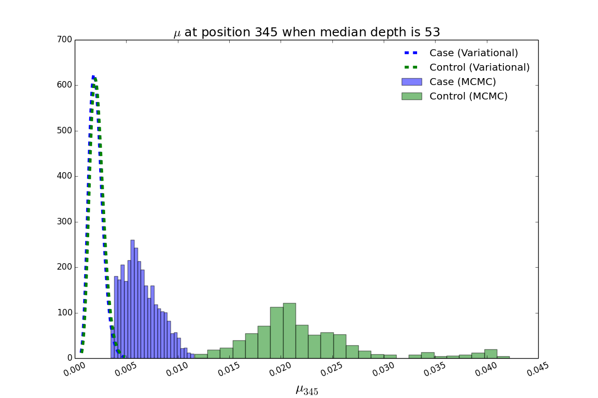

- MCMC and Variational both fail to call position 345. 

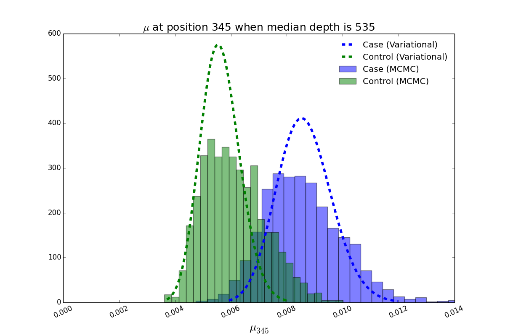

- MCMC and Variational both fail to call position 345.  
- variance ^ mcmc > variance ^ variational

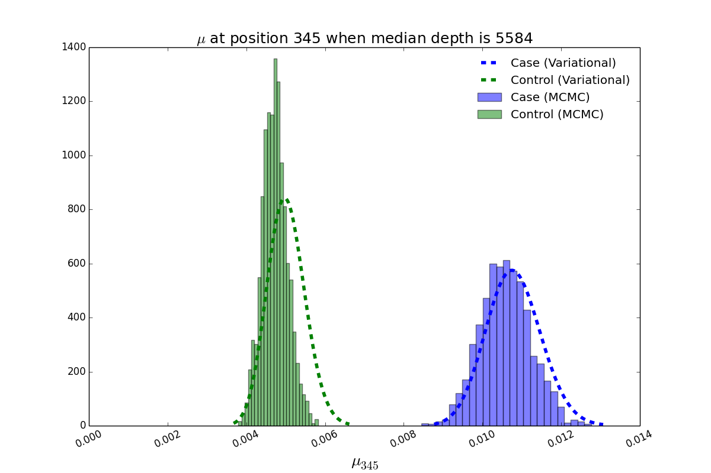

- MCMC and Variational both call position 345 successfully.  
- variance ^ mcmc = variance ^ variational

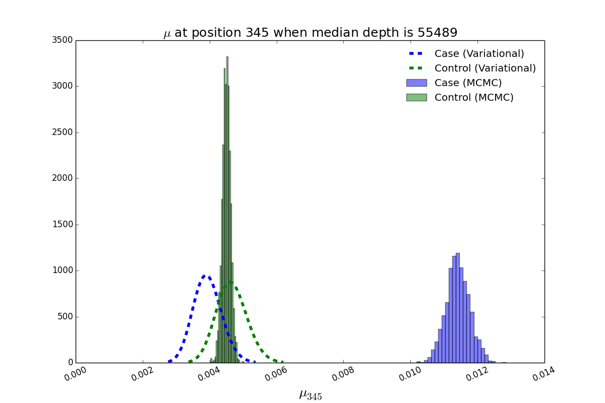

- MCMC is able to call position 345, while Variational is not able to call that.   
- variance ^ mcmc < variance ^ variational for control

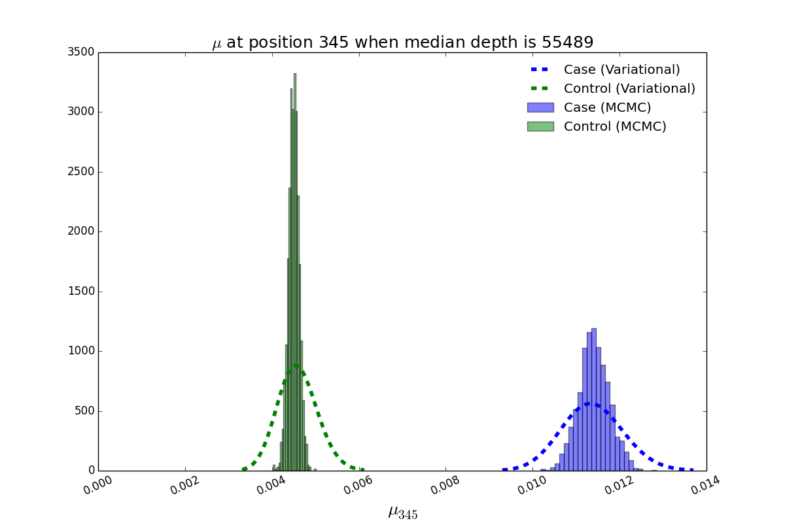

- Variational is able to call 345 with another random initial gam.

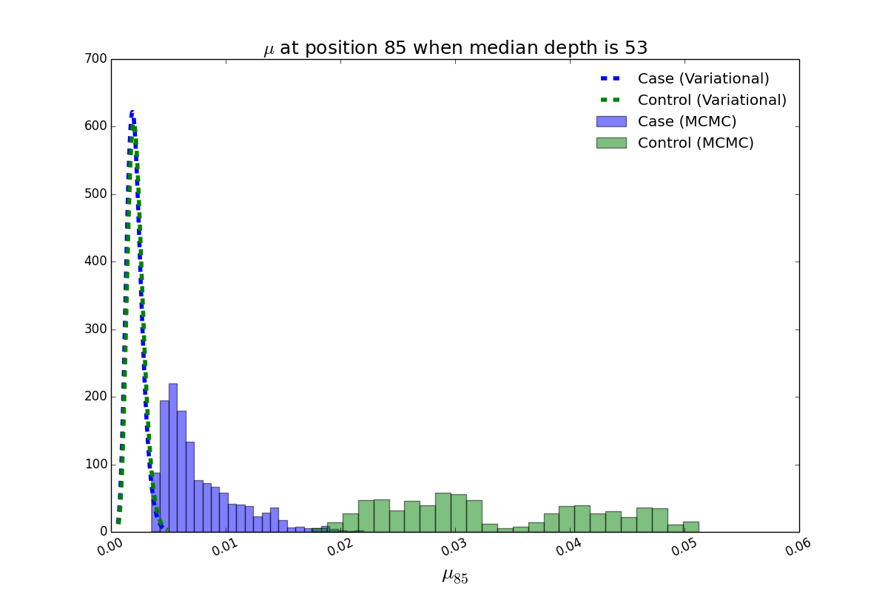

- MCMC and Variational both fail to call position 85. 

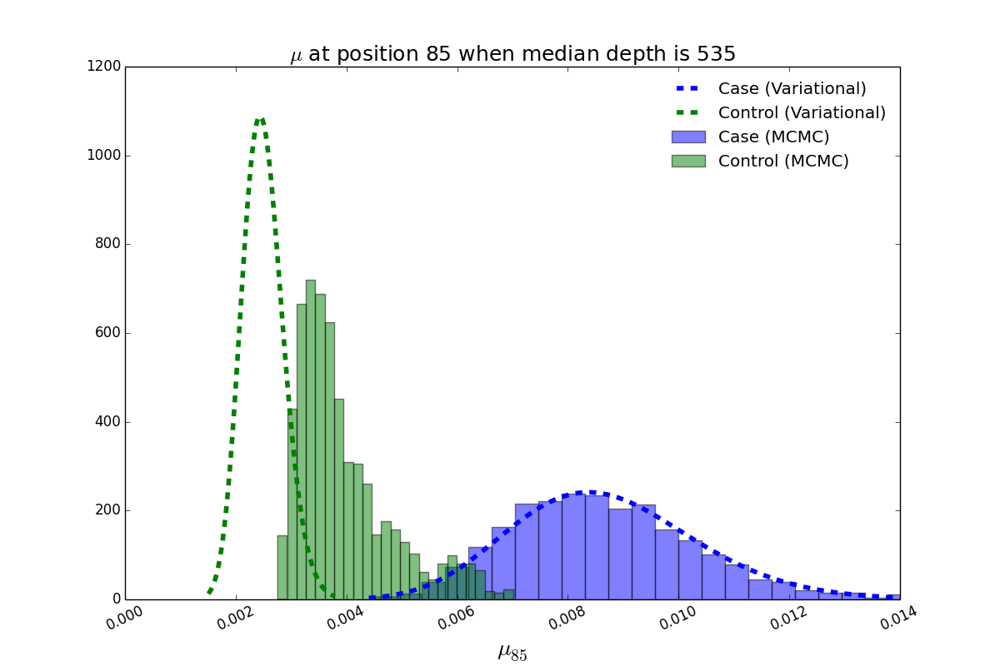

- MCMC and Variational both fail to call position 85.  
- variance ^ mcmc > variance ^ variational for control

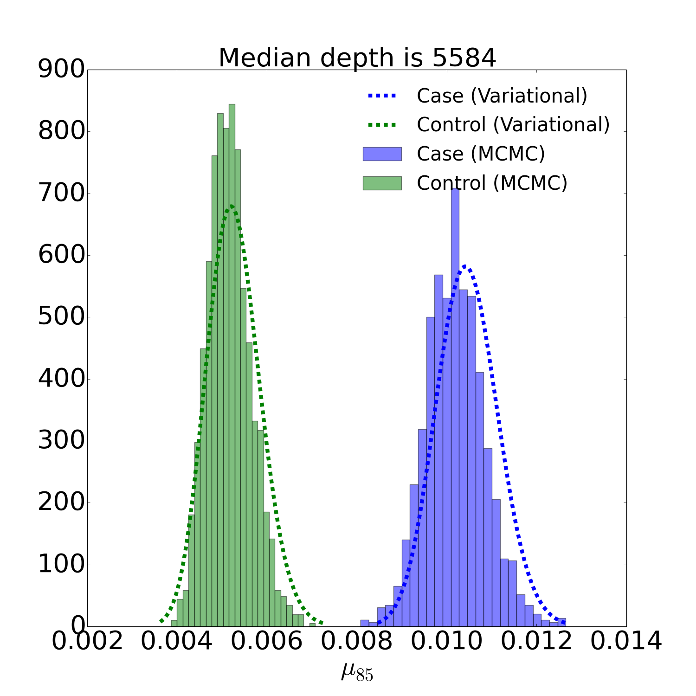

- MCMC and Variational both call position 85 successfully.  
- variance ^ mcmc = variance ^ variational

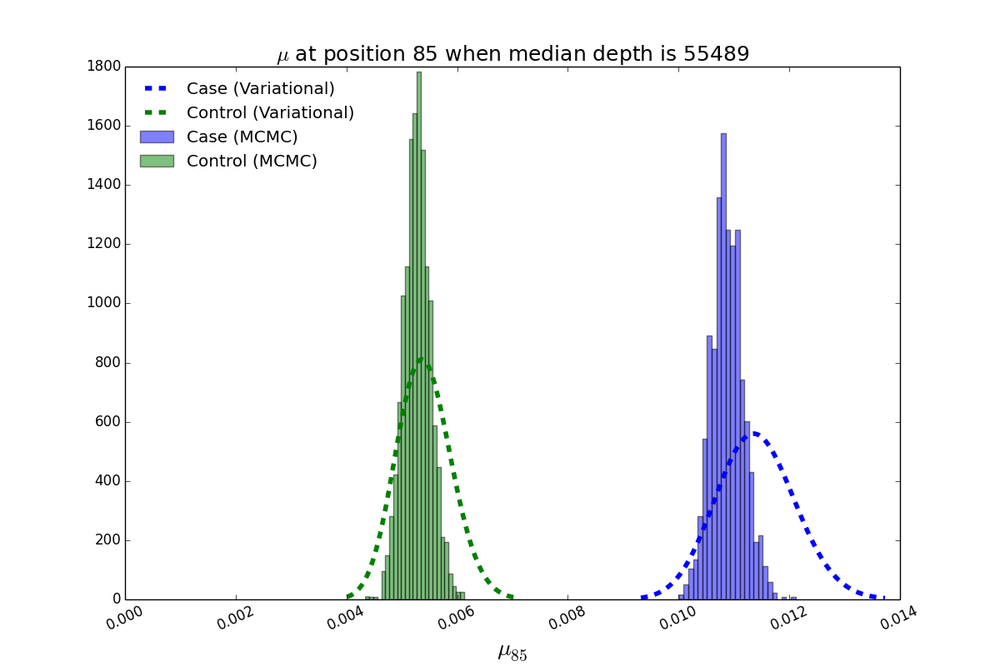

- MCMC and Variational both call position 85 successfully.  
- variance ^ mcmc < variance ^ variational

####Study false positive positions

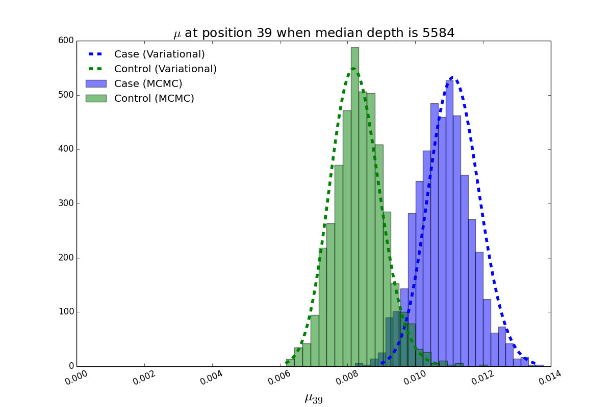

- MCMC and Variational both call position 39 at 5584 read depth when VAF=0.1% as a false positive position.

**Variational is successful to call true positive positions. MCMC call many false positive positions.**
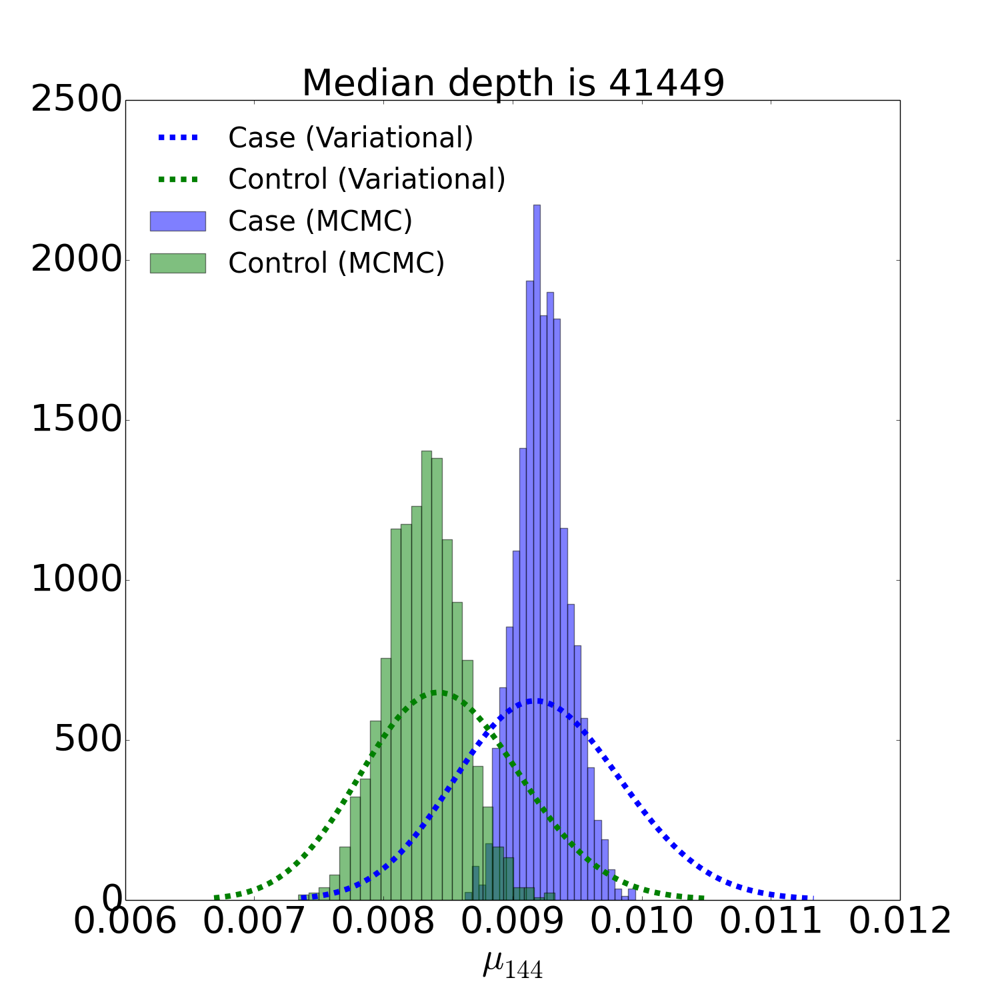

- MCMC called this position as a false positive, but Variational didn't call this. Variational has wider variance than MCMC.
 

###Add these tow figs into RVD3 paper

Archived Samples
-------------------------

Archived Computer Data
------------------------------

Prepared by: _______Fan Zhang_______     Date: ______2105/10/25_______________

Witnessed by: ________________________
