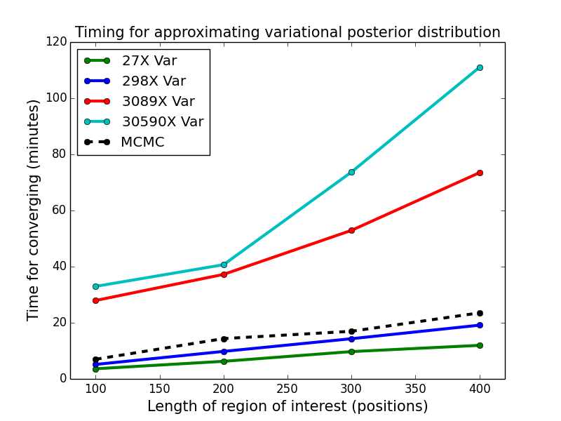

2015-10-15 Plot time vs region length rvd3 synthetic data
==============================

Purpose
------------
Test timing of rvd3 on the synthetic data set when increasing the number of positions (different length of region of interest).

Conclusions
-----------------
Time for approximating variational posterior distribution is increased by increasing the length of region of interest and the median read depth.

Background
-----------------

Materials and Equipment
------------------------------

    `head -101 20100916_c2_p1.14_TCT.dc > top_100_positions/20100916_c2_p1.14_TCT.dc`
    `head -201 20100916_c2_p1.14_TCT.dc > top_200_positions/20100916_c2_p1.14_TCT.dc`
    `head -301 20100916_c2_p1.14_TCT.dc > top_300_positions/20100916_c2_p1.14_TCT.dc`

	synthetic_toc_p1_test_time

Experimental Protocol
---------------------------
    `python runall.py`

Results
----------- 

- 60 processes are used to estimate the model for 6 replicates of VCF=100.0%.

Archived Samples
-------------------------

Archived Computer Data
------------------------------

Prepared by: _______Fan Zhang_______     Date: ______2105/10/15_______________

Witnessed by: ________________________
