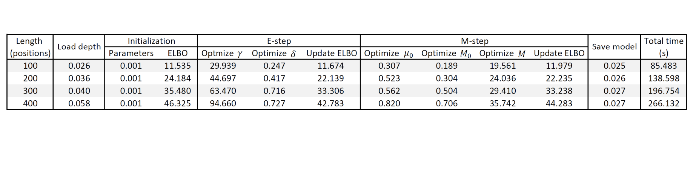

2015-10-21 Timing profile rvd3 program
==============================

Purpose
------------
Generate a timing table by a timing profile to see what function is taking the most time.

Conclusions
-----------------

Integration for optimizing gamma in E-step and optimizing M in M-step takes most of the time.

Background
-----------------

Materials and Equipment
------------------------------
According to the timing plot in folder 2015-10-15\_Plot\_time\_vs\_region\_length\_rvd3\_synthetic_data. For 3089X do a timing profile.

Experimental Protocol
---------------------------

Results
----------- 

Archived Samples
-------------------------

Archived Computer Data
------------------------------

Prepared by: _______Fan Zhang_______     Date: ______2105/10/22_______________

Witnessed by: ________________________
