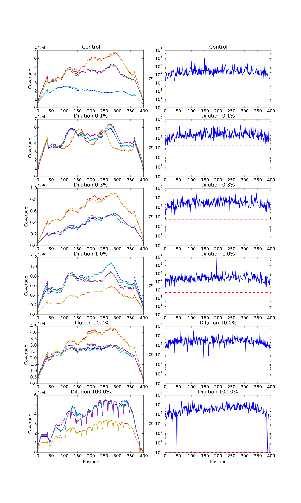
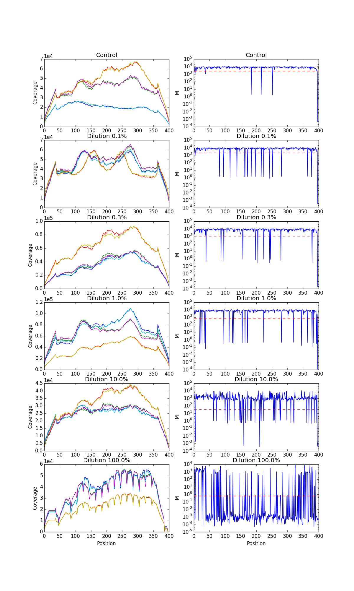
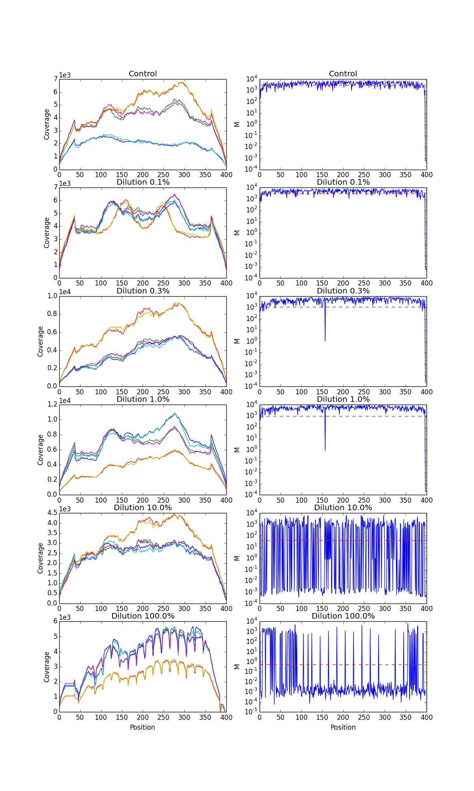
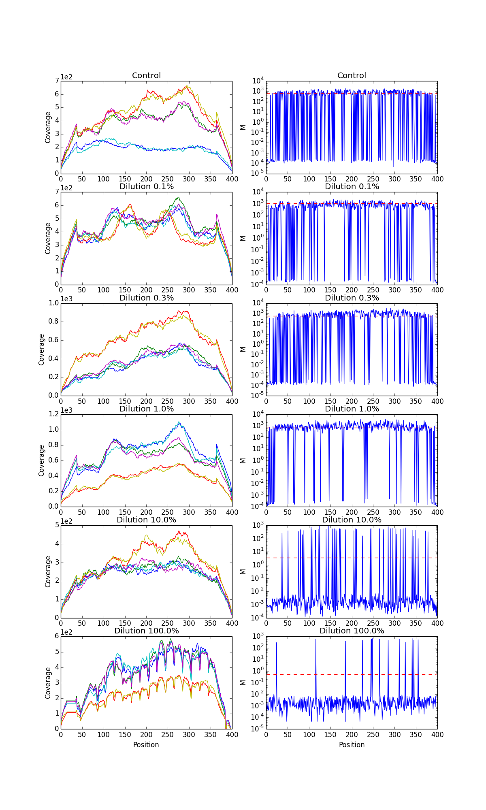
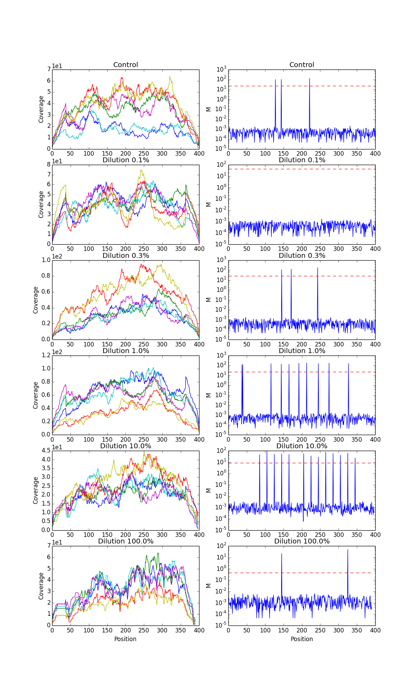

2015-10-27 Plot M rvd3 synthetic data set
==============================

Purpose
------------
Plot M from rvd3 to see how Mj looks like for the synthetic data set.  
Compare M from RVD3(variational) with M from RVD2(MCMC) .

Conclusions
-----------------
**Compare M from RVD3 with M from RVD2 when downsample is 1/10:**

1. M from RVD3 is similar (10^4) with that in RVD2 at control and samples of VAF=0.1%, 0.3%, 1.0%, and 10.0% events. But M from RVD3 is decreased when 100.0%.
2. M from RVD3 is more variable than M from RVD2.  
2. M0 from RVD3 is the same with that in RVD2.  

Background
-----------------
Refer to supplementary Figure 2. Key parameters for RVD2 model for synthetic DNA data sets.

Materials and Equipment
------------------------------
The results files (HDF5 and VCF) are in folder "2015-09-28\_Run\_synthetic\_data\_set\_threshold\_delta\_gamma\_ELBO\_update".

Experimental Protocol
---------------------------
    `python plot_M`

Results
----------- 
Coverage and M across different postions of different downsample read depth are ploted.

####- MCMC results of M from RVD2 paper is also shown for comparison.

####- Event of downsample rate = 1/10  
#####Compare this with M from MCMC,   
#####1. M from RVD3 is similar (10^4) with that in RVD2 at control and samples of VAF=0.1%, 0.3%, and 1.0% events. But M is getting more variable and decreased when VAF=10.0% and 100.0%.  
#####2. M0 from RVD3 is the same with that in RVD2.

####- Event of downsample rate = 1/100

####- Event of downsample rate = 1/1000

####- Event of downsample rate = 1/10000

**At the event of depth is 39 and VAF=0.1%:**  
We called all the positions without chi2, but we didn't call anything with chi2 at this event.  
From the M plot, we know M0 is between 10 and 100, which is big. M is between 10^-4 and 10^-3, which is small.

Archived Samples
-------------------------

Archived Computer Data
------------------------------

Prepared by: _______Fan Zhang_______     Date: ______2105/10/29_______________

Witnessed by: ________________________
